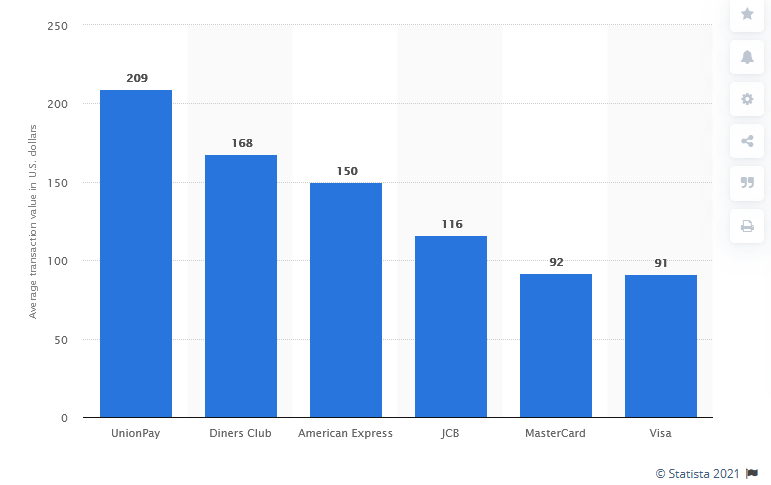
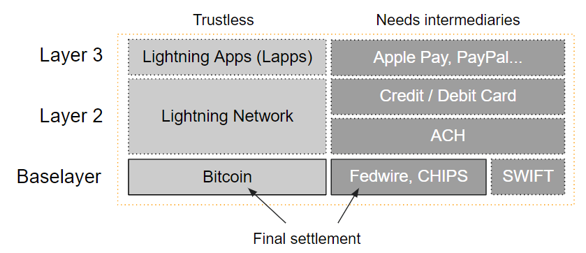
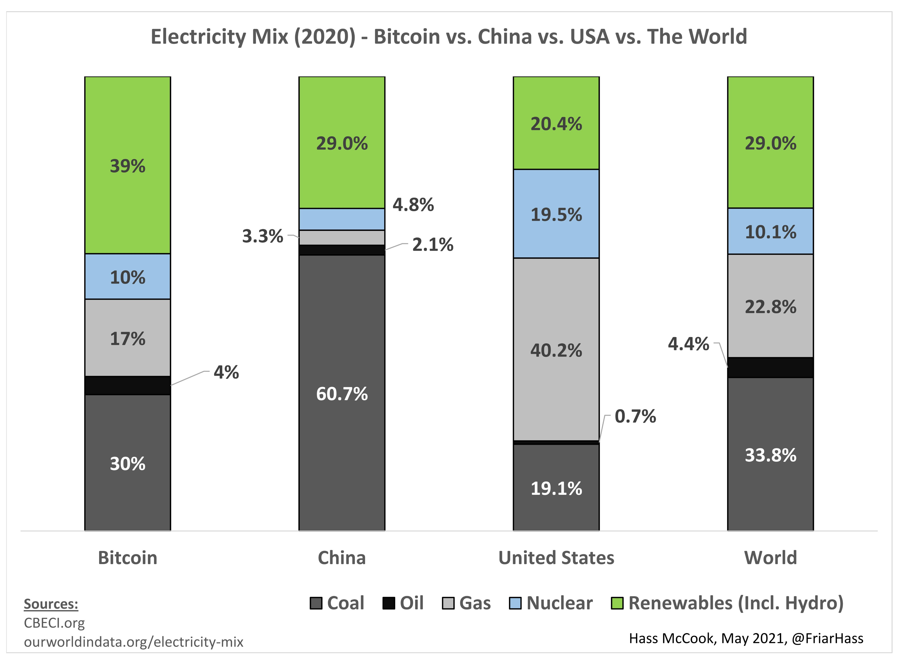

### Bitcoin's Ecological Footprint
_Bitcoin consumes a lot of electricity, which will increase our climate crisis and is irresponsible._

*Figure* [^35]
 

The above screenshot is an article from Newsweek right in the middle of the 2017-2018 bull run. It is based on the work of Alex de Vries (Digiconomist), a former data analyst for the Dutch Central Bank. Many research papers and mainstream media articles are based on his false assumptions like comparing Bitcoin transactions' energy consumption to VISA payments and calculating a carbon footprint from this. I argue that a lot of this work is done to spread false claims in order to demonize Bitcoin.

> "Every time we have a rally in Bitcoin we see all of this negative attention to the environmental impact of Bitcoin. Apparently it only matters when the price is high." - **Andreas M. Antonopoulos**

Let's dive into this. Bitcoin critics often mention that Bitcoin consumes more energy than the benefits it creates. It's undeniable that Bitcoin mining requires lots of electricity. It is estimated that between 80 and 118 TWh per year are used globally for mining which is equivalent to the entire power consumption of countries like the Netherlands.

*Figure* [^36]
 

The world wastes a lot of electricity. The amount of electricity consumed every year by always-on but inactive home devices in the USA alone could power the Bitcoin network for 1.9 years. This means that the amount of energy wasted in the USA could almost power the Bitcoin network twice over, year-on-year. [^37]

At the same time, two-thirds of all energy produced in the USA is lost. It's reasonable to assume that this is happening in all other parts of the world too.

*Figure* [^38]
 

Notice that rejected energy accounts for around 62% of all electricity generation. Rejected energy is energy that is produced but ultimately does not go to useful work. To make matters worse, over time, this number has been increasing on a relative basis. In 1970 Lawrence Livermore National Laboratory found our proportion of rejected energy was around 48%. [^39]

To put it another way, Bitcoin accounts for 0.54% of all electricity used globally.

*Figure* [^40]
 

**Electricity Consumption Easy to Quantify**
Bitcoin's transparency allows estimations of its energy demand quite in contrast to many other industries, where these data points are more obscure. Measured by electricity costs alone, we can assume that Bitcoin is [much more efficient](https://medium.com/@danhedl/pow-is-efficient-aa3d442754d3) than traditional banking and gold mining on a global scale.

Bitcoin mining’s estimated dollar cost per Gigajoule expended is 40 times more efficient than that of traditional banking and 10 times more efficient than that of gold mining.

*Figure* [^41]
 

**Why Does Bitcoin Need This Amount of Electricity**
The proof-of-work mining mechanism is a fundamental feature that secures the independence, neutrality and automated integrity of the network. It is the most secure way to prevent attacks on the assets worth over 600 billion USD that are locked in the network. (BTC market cap, June 2021)

Bitcoin can settle transactions without intermediaries because specialized, dedicated hardware proves transparently that the computer has executed a costly computation.

Proof-of-work is anchoring digital money in the real world. As Chaincode Labs resident Hugo Nguyen explains, "Under the hood, proof-of-work mining converts kinetic energy (electricity) into a ledger block. By attaching energy to a block, one gives it ‘form’, allowing it to have real weight and consequences in the physical world." [^42]

Proof-of-work is also the only mechanism that allows an equally distributed, decentralized creation of coin supply, whereas other methods require initial token drops and token generation events that allow centralized actors to take advantage of pre-mined coins (Proof-of-stake).

**Assumption #1: It Takes X Kilowatts to Do a Single Transaction**
This is faulty mathematics. The use of energy for bitcoin does not scale to the number of transactions. The number of transactions that happen on-chain and the number of transactions that happen off-chain - for instance, on second-layer technologies like the Lightning Network or through custodial exchanges, that batch transactions - are not correlated at all to the cost of mining. 80-90% of mining is driven by bitcoin's price, with the other 10-20% being driven by fees. The higher the possible profit for miners, the more chance that miners will set up new mining facilities and, when the price crashes, some will have to stop their machines. In the long term, when all 21 million bitcoin have been mined, the transaction fees alone will drive mining. At that point, transaction intensity will be more correlated to energy usage. But not today, the last satoshi will be mined in 2140. Mining is driven by competition in a free market where mining difficulty adjusts dynamically. It has nothing to do with how many transactions are being processed. Mining is a mechanism for security. It relates to how much security the market allocates to the system, so more energy equals more security and when the price of bitcoin goes up the amount of money allocated to protect it also increases naturally. Therefore usage and higher adoption drive additional financial motivation for miners to produce more security by consuming more energy.

**Assumption 2: Linear Extrapolation**
The second wrong assumption is to extrapolate linearly and say that, if it takes X kilowatts of energy to make one transaction today and we have seven and a half billion people on the planet who will want to make one transaction per day each, then bitcoin's energy consumption in the future will be Y. This is false. Bitcoin can't scale linearly in terms of transactions because of block size constraints on the base layer. To mitigate that, second-layer protocols like the Lightning Network or sidechains like Liquid are developed, which allow thousands of payments without the need for extra energy. The efficiency of mining equipment is rising. Miners need less power for the same amount of computing performance over time. Additionally, Bitcoin developers are improving the code, minimizing the data size of transactions so that more transactions can be mined in one block.

**Assumption 3: Comparing VISA to Bitcoin**
A Bitcoin on-chain transaction cannot be compared with a VISA payment. It is not the same. In traditional banking there are various layers of settlement, meaning they differ in their level of security and finalization. Let's take the example of the US system, which is comparable globally. The base layer is Fedwire, CHIPS and SWIFT networks, while debit card and credit card payments operate one or two levels above with many intermediaries. The base layer of Bitcoin has to be compared with Fedwire, CHIPS and SWIFT. Only second-layer solutions like fast, micropayments on the Lightning Network can be compared with VISA.

*Figure* [^43]
 

Let's take a look at the average transaction volume of VISA and Bitcoin.

*Figure* [^44]

*Figure* [^45]
 

The average bitcoin transaction value was 258,766 USD on April 21st, 2021, while the average VISA transaction was 91 USD in 2012. Bitcoin transactions transport magnitudes more value in comparison to credit card payments. Assuming Bitcoin gains mass adoption then it might one day settle millions of dollars worth like the Fedwire system at very low fees compared to the banking system.

The average transaction value per Fedwire transfer was 4.5 million USD in February 2021. [^46]

*Figure* [^47]
 

Bitcoin transactions are settled every 10 minutes, 24 hours per day, 365 days per year. Compare this to ACH transactions which can take up to two years to be finally settled. [^48] Not to forget: Bitcoin and Lightning transactions are permissionless and trustless while the traditional payment system only works because intermediaries take custody of fraud and chargebacks.

**Assumption 4: Equating Energy Consumption With Pollution**
People say, for example, that "every transaction pollutes" or "bitcoin's pollution is increasing" or "bitcoin produces pollution as a result of its energy consumption" - that's simply not true. There is no direct correlation between energy usage and pollution because it depends entirely on what type of energy is being used. If you're producing energy with coal, that causes pollution and environmental impact. If you're producing energy with hydroelectric dams or wind or solar for example, then you're not actually polluting. In fact, you're subsidizing those energy mechanisms and incentivizing the creation of more solar, wind, geothermal, off-gassing and other forms of energy through the application of bitcoin as an economic factor in the production of that energy.

Bitcoin miners are profit-driven, so they will always look for the cheapest energy, which is renewable. Coal and oil will always be more expensive than hydroelectric, geothermal, stranded gas, wind and solar power. Not to forget nuclear, which is also an option that many count as green energy.

Indisputably, Bitcoin miners are using otherwise wasted energy. I spoke with [Sébastien Gouspillou](https://anita.link/103) and [Philippe Bekhazi](https://anita.link/101) two miners using hydropower, who confirmed the above statements.

**Energy Mix of Electricity Production**
Bitcoin miners are fairly well distributed across the globe. While it is easy to quantify the electricity demand, it is more difficult to quantify the electricity sources since the Bitcoin mining industry remains a highly private and pseudonymous industry. Therefore, research on the electricity used in mining estimates renewable energy usage varies from 39% (Cambridge Center, CBECI.org) to 73% in the CoinShares Mining Whitepaper, which concludes:

"Using a combination of estimates of global mining locations and regional renewables penetrations we again calculate the Bitcoin mining industry to be heavily renewables-driven. Our current approximate percentage of renewable power generation in the Bitcoin mining energy mix stands at 73%, around four times the global average. Overall, our findings reaffirm our view that Bitcoin mining is acting as a global electricity buyer of last resort and therefore tends to cluster around comparatively under-utilised renewables infrastructure. This could help turn loss making renewables projects profitable and in time - as the industry matures and settles as permanent in the public eye - could act as a driver of new renewables developments in locations that were previously uneconomical." [^49]

The question is not how much energy is required, but how is electricity produced? How much CO2 is emitted? If we decide as a society that we don't want polluting energy, then we should regulate the production of energy and not allow the use of polluting systems. This is about regulating energy production and not about regulating the consumption of energy in one particular sector of the economy which happens to be Bitcoin.

Bitcoin uses a higher amount of electricity from renewables than the grid in China the USA and the wider world.

*Figure* [^50]
 

**Carbon Emissions**
Some research has tried to assess the carbon emission flows and sustainability of Bitcoin through estimating future demand, based on false assumptions. One paper for instance is claiming that: "the annual energy consumption of the Bitcoin blockchain in China is expected to peak in 2024 at 296.59 Twh and generate 130.50 million metric tons of carbon emission correspondingly." [^51]

> "It’s an immediate red flag that the authors confidently declare Bitcoin’s future carbon outlay to two decimal places, when realistically the number can only be estimated to within an order of magnitude.", states **Nic Carter**. [^52]

Based on the [work of Hass McCook](https://bitcoinmagazine.com/business/bitcoin-vs-financial-sector-energy-use) Bitcoin emits less than 2% of the world's military-industrial complex and less than 5% of the legacy financial sector's carbon emissions. The annual global greenhouse gas emissions are approx. 50,000 million ton carbon dioxide equivalent. Bitcoin emits only 0.11% of those.

*Figure* [^53]
 

**Final Assumption: Bitcoin Isn't Useful, Therefore Any Use of Energy for a Bitcoin Is Wasteful**

If you decide Bitcoin isn't useful, then this is a very subjective opinion. Bitcoin might not make sense to you, but it might make sense for many other people. If you are making this argument, you must agree that there are many other forms of energy use that are prima facie useless or even damaging in their use, and they don't receive the same amount of scrutiny.

We can light up billions of Christmas lights every year for a display of Christmas spirit, which might be completely pointless for billions of people of other beliefs. The number one use of energy in the United States, for example, outside of civilian markets is the Department of Defense. The US government uses enormous amounts of energy and is the largest polluter in the country, arguably for no legitimate reason other than seeking extreme control.

*Figure* [^54]
 

This leads back to the chapter about the Petrodollar, the linkage between the US dollar and the OPEC, which makes the USA the globally dominant powerhouse and is secured by the US military and wars in the Gulf region.

Is the war machine a useful thing to have in our society? Before you scream "Whataboutism!", say that it's comparing two different things and demand we should reduce the use of the war machine as well as the use of bitcoin, do not forget there's a very important link that is missing. The war machine all around the world is funded directly by fiat debt that is produced and paid off through inflation that is enabled through the uncontrolled central bank printing money, which in the end you, the taxpayer, are fronting the bill for. Bitcoin isn't just a solution for an open economy, it's a solution that constrains governments from producing currency at unreasonable rates and using inflation as a hidden form of taxation to fund the war machine, which ultimately pollutes and damages more than anything else in existence. Bitcoin isn't simply a substitute for general economic activity, it's also a direct control on the war machine that pollutes and uses far more energy simply to kill people. So in my opinion those two things are very closely tied. But that's just Andreas M. Antonopoulos' and my own opinion.

**Conclusion: The Benefits of Bitcoin**

I spoke to someone who was saved from starvation in Venezuela between 2016 to 2019 thanks to Bitcoin. Bitcoin literally saves lives! What can be more useful than that?

Bitcoin is uncensorable, incorruptible, and allows billions of people open access to a global money system, regardless of color, gender, wealth, and status. Furthermore, it is our only chance to secure financial privacy, or at least pseudonymity, in a world of digital surveillance.

The Bitcoin network secures assets for about 100 million users globally, worth over 600 billion USD (June 2021) without any upper limit and does not rely on military power or currency wars.

Here is a conclusion, as put by ARK Invest: "Contrary to consensus thinking, we believe the environmental impact of bitcoin mining is de minimis. Renewables, particularly hydroelectric power, accounts for a large percentage of bitcoin’s energy mix. As Castle Island Ventures partner, Nic Carter, has noted, in their search for the cheapest form of electricity, miners will continue to flock to regions offering a glut of renewable electricity, unlocking stranded energy assets as 'electricity buyer's of last resort, creating a highly mobile base-demand for any electricity sources able to produce at prices below current producers, regardless of location.' As a result, from a climate perspective, bitcoin mining could be a net positive." [^55]

[^35]: [Source Newsweek, 12/11/2017](https://www.newsweek.com/bitcoin-mining-track-consume-worlds-energy-2020-744036)  
[^36]: [Source Cambridge Center for Alternative Finance, March 2021](https://cbeci.org/cbeci/comparisons/)  
[^37]: [Cambridge Center for Alternative Finance](https://cbeci.org/cbeci/comparisons/)  
[^38]: [Source Energy Flow Chart, Lawrence Livermore National Laboratory](https://flowcharts.llnl.gov/)  
[^39]: [Conner Brown, Bitcoin: a bold american future](https://journal.bitcoinreserve.com/bitcoin-a-bold-american-future/)  
[^40]: [Cambridge Center for Alternative Finance, March 2021](https://cbeci.org/cbeci/comparisons/)  
[^41]: [Source, ARK Invest, Bitcoin myths](https://ark-invest.com/articles/analyst-research/bitcoin-myths/)  
[^42]: [ARK Invest Bitcoin myths](https://ark-invest.com/articles/analyst-research/bitcoin-myths/)  
[^43]: [Source Statista](https://www.statista.com/statistics/881541/bitcoin-energy-consumption-transaction-comparison-visa/)  
[^44]: [Source Statista](https://www.statista.com/statistics/279308/average-credit-card-transaction-value-worldwide/)  
[^45]: [Source BitInfoCharts](https://bitinfocharts.com/comparison/bitcoin-transactionvalue.html#1y)  
[^46]: [Source The Federal Reserve Services](https://frbservices.org/resources/financial-services/wires/volume-value-stats/monthly-stats.html)  
[^47]: Anita Posch  
[^48]: [Caitlin Long](https://twitter.com/CaitlinLong\_/status/1384925713648734212?s=20)  
[^49]:[CoinShares, Bitcoin Mining Whitepaper 2019](https://coinshares.com/research/bitcoin-mining-network-december-2019)  
[^50]: [Source: Hass McCook](https://bitcoinmagazine.com/business/what-elon-musk-gets-wrong-about-bitcoin)  
[^51]: [Nature communications](https://www.nature.com/articles/s41467-021-22256-3)  
[^52]: [Nic Carter, On Bitcoin, the Gray Lady Embraces Climate Lysenkoism](https://medium.com/@nic__carter/on-bitcoin-the-gray-lady-embraces-climate-lysenkoism-a2d31e465ec0)  
[^53]: [Source Annual Greenhouse Gas Emissions, Hass McCook, June 2021](https://bitcoinmagazine.com/culture/bitcoin-vs-world-military-emissions)  
[^54]: [Source Statista](https://www.statista.com/chart/18359/estimated-military-carbon-dioxide-emissions/)  
[^55]: [ARK Invest Bitcoin myths](https://ark-invest.com/articles/analyst-research/bitcoin-myths/)  
